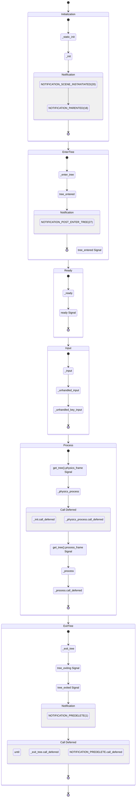

# Godot生命周期

```mermaid
stateDiagram-v2
    [*] --> Initialization 
    Initialization --> EnterTree  
    EnterTree --> Ready
    Ready --> Input
    Input --> Process
    Process --> ExitTree
    ExitTree --> [*]
    state Initialization  {
         [*] --> _static_init
         _static_init --> _init
         _init --> _notification_init
         _notification_init --> [*]
        state "Notification" as _notification_init {
        NOTIFICATION_SCENE_INSTANTIATED(20)  --> NOTIFICATION_PARENTED(18)
        } 
    }
   
    state EnterTree {
        [*] --> _enter_tree
        _enter_tree --> tree_entered
        tree_entered --> _notification_tree_enter
        _notification_tree_enter --> [*]
        state "tree_entered  Signal" as signal_tree_entered 
        state "Notification" as _notification_tree_enter {
            NOTIFICATION_POST_ENTER_TREE(27)
        } 
    }
    state Ready {
        [*] --> _ready
        _ready --> signal_ready
        signal_ready --> [*]
         state "ready Signal" as signal_ready 
    }
    state Input {
        [*] --> _input
        _input --> _unhandled_input
        _unhandled_input --> _unhandled_key_input
        _unhandled_key_input --> [*]
    }
    state Process {
        [*] --> signal_physics_frame
        signal_physics_frame --> _physics_process
        _physics_process --> call_deferred_process
        call_deferred_process --> signal_process_frame
        signal_process_frame --> _process
        _process --> _process_call_deferred
        _process_call_deferred --> [*]
        state "Call Deferred" as call_deferred_process {
            state "_init.call_deferred" as _init_call_deferred
            until
            state "_physics_process.call_deferred" as _physics_process_call_deferred
        }
        state "_process.call_deferred" as _process_call_deferred
        state "get_tree().physics_frame Signal" as signal_physics_frame
        state "get_tree().process_frame Signal" as signal_process_frame
    }
    state ExitTree {
        [*] --> _exit_tree
        _exit_tree --> signal_tree_exiting
        signal_tree_exiting --> signal_tree_exited
        signal_tree_exited --> _notification_tree_exit
        _notification_tree_exit -->  call_deferred_tree_exit
        call_deferred_tree_exit --> [*]
        state "tree_exiting Signal" as signal_tree_exiting
        state "tree_exited Signal" as signal_tree_exited 
        state "Notification" as _notification_tree_exit {
            NOTIFICATION_PREDELETE(1)
        } 
        state "Call Deferred" as call_deferred_tree_exit {
            state "_exit_tree.call_deferred" as _exit_tree_call_deferred
            until
            state "NOTIFICATION_PREDELETE.call_deferred" as _notification_predelete_call_deferred
        }
    }
```